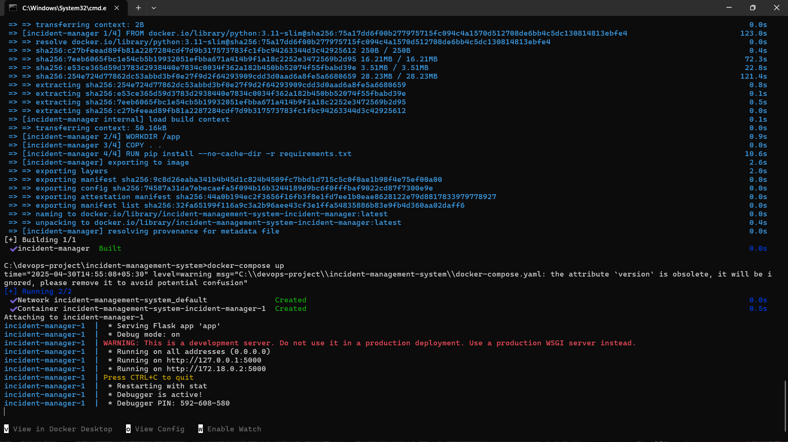
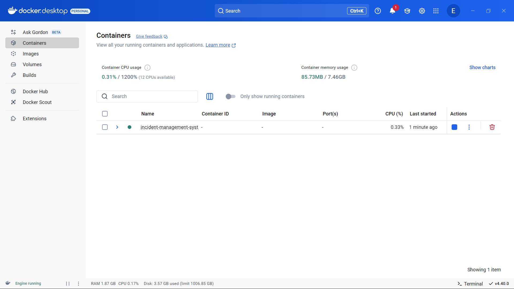
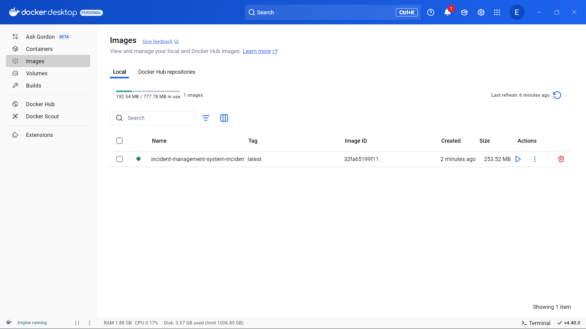
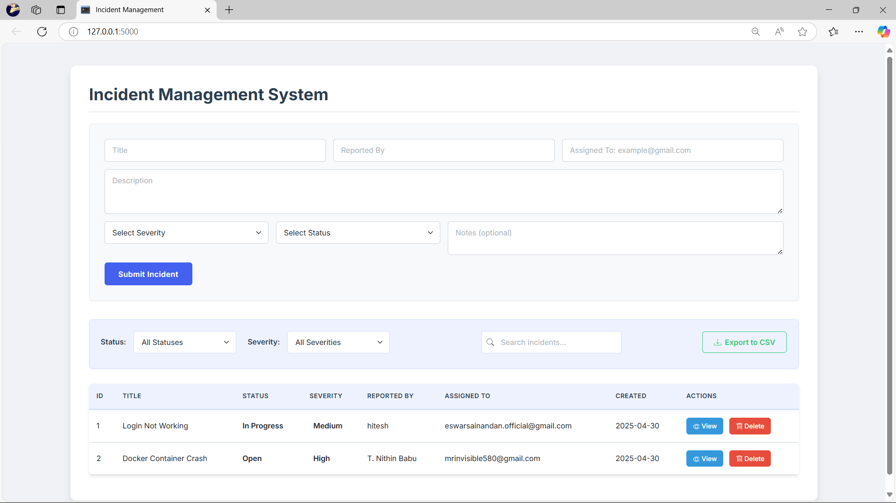
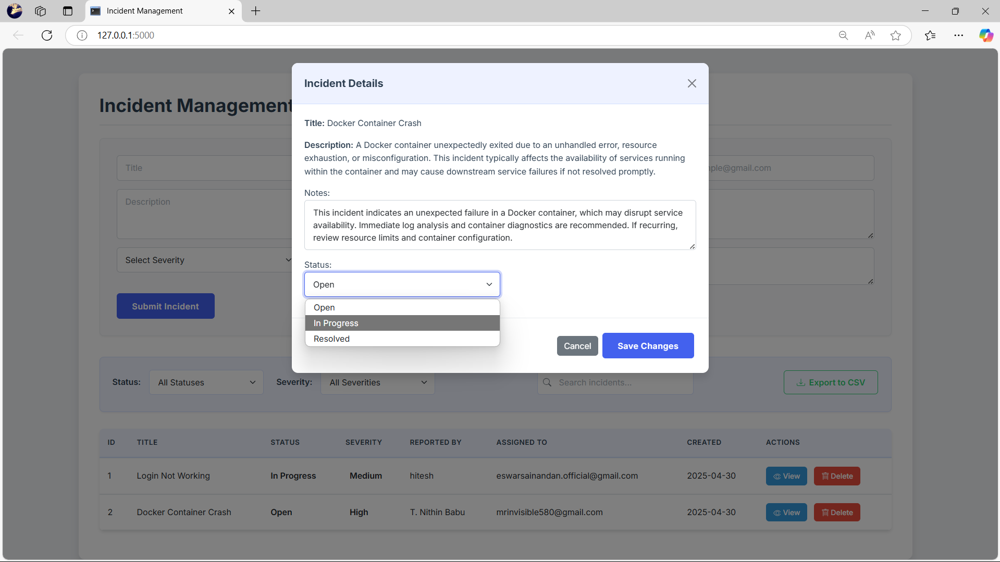
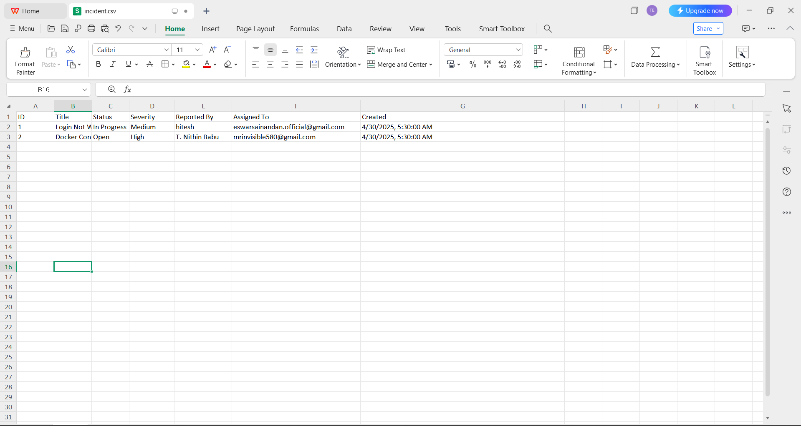
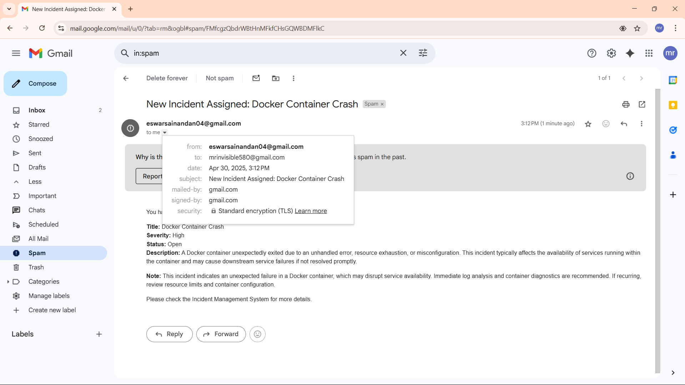
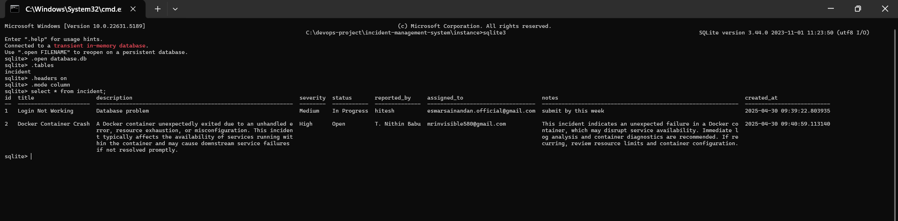

# 🚨 Incident Management System

A web-based Incident Management System built with **Flask**, **SQLite**, and **Bootstrap**, designed for tracking, viewing, and exporting incident reports. Easily deployable using **Docker**.

---

## 🐳 Docker Command & Usage Screens

### 1. Docker Commands  


### 2. Running Docker Container  


### 3. Docker Image  


---

## 📦 Features

- Create, view, edit, and delete incidents
- Filter and sort incidents by various parameters
- View incident details on a separate page
- Export incident data to **CSV**
- Admin-only delete capability
- Fully Dockerized setup for easy deployment
- SMTP email Notifications
- SQLITE3 Database for storing incidents

---

## 🖥️ App Screenshots

### Main Page  


### Incident Detail View  


### Export to CSV  



### SMTP Services  


### SQLite3 Database  


---

## 🐳 Docker Setup

### 1. Build the Docker Image
```bash
docker-compose build
docker-compose up


